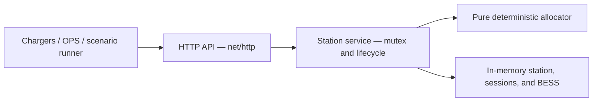

# Station Energy Management System

A small Go service that manages power for one EV charging station. It accepts station configuration and charging-session events, allocates power deterministically under physical constraints, reacts synchronously to state changes, and exposes the live station state through a REST API.

The implementation deliberately favors correctness, explainability, and reviewer usability over production infrastructure.

## What it does

- Shares constrained power fairly across concurrent sessions.
- Respects grid, charger, connector, vehicle, and charging-curve limits.
- Redistributes unused power when demand or station state changes.
- Starts, updates, and stops sessions synchronously.
- Pauses sessions at `0 kW` when their useful minimum cannot be met.
- Ends affected sessions when a charger or connector becomes unavailable.
- Optionally uses a BESS to boost EV supply or consume spare grid power.
- Reports station, charger, connector, session, and BESS state for OPS.

## Implemented scope

The core assignment is complete: one in-memory station, deterministic allocation, session lifecycle, REST API, concurrency protection, tests, Docker packaging, and runnable examples.

The following optional extensions are also implemented:

- Minimum useful charging power and `waiting_for_power`
- Charger and connector availability events
- BESS boost and spare-grid charging
- Lightweight BESS SoC tracking through explicit simulation ticks

## Quick start with Docker

Requirements: Docker with Docker Compose.

Start the API:

```bash
docker compose up --build
```

The server listens at `http://localhost:8080`. In another terminal, run the complete reviewer scenario:

```bash
python3 examples/run_scenarios.py
```

The runner configures the station and demonstrates fair sharing, redistribution, hardware outages and recovery, BESS charging and boost, deterministic SoC updates, and minimum-SoC fallback.

## Run locally

Requirements: Go `1.26`.

```bash
go run ./cmd/server
```

Set `PORT` to override the default `8080` port:

```bash
PORT=9090 go run ./cmd/server
```

State is held in memory and is reset whenever the process restarts. Replacing station configuration also clears active sessions and initializes the BESS from the new configuration.

## HTTP API

| Method | Path | Purpose | Success |
| --- | --- | --- | --- |
| `GET` | `/health` | Liveness check | `200` |
| `PUT` | `/api/v1/station/config` | Configure or replace the station | `200` |
| `GET` | `/api/v1/station` | Query current OPS state | `200` |
| `POST` | `/api/v1/sessions` | Start a charging session | `201` |
| `PATCH` | `/api/v1/sessions/{sessionId}` | Update session power limits | `200` |
| `DELETE` | `/api/v1/sessions/{sessionId}` | Stop a session and redistribute power | `200` |
| `PATCH` | `/api/v1/chargers/{chargerId}` | Change charger availability | `200` |
| `PATCH` | `/api/v1/connectors/{connectorId}` | Change connector availability | `200` |
| `POST` | `/api/v1/simulation/tick` | Advance BESS energy accounting | `200` |

The simulation endpoint accepts elapsed time explicitly:

```json
{"elapsedSeconds": 900}
```

Power values use kW, BESS energy capacity uses kWh, and SoC uses percent.

Errors use one JSON shape with a stable machine-readable code:

```json
{"code":"connector_occupied","message":"connector is occupied"}
```

The API uses `400` for malformed or invalid input, `404` for unknown or unconfigured resources, `409` for lifecycle conflicts, and JSON `405` responses for unsupported methods.

## Architecture



The package boundaries are intentionally small:

| Package | Responsibility |
| --- | --- |
| `internal/domain` | Station, hardware, session, and BESS types plus validation |
| `internal/allocation` | Pure deterministic admission and max-min fair allocation |
| `internal/service` | In-memory state, locking, lifecycle orchestration, BESS dispatch, and snapshots |
| `internal/api` | Thin HTTP handlers, DTOs, JSON handling, logs, and status-code mapping |
| `cmd/server` | Server construction and process entry point |

Every accepted state-changing request is validated, applied, reallocated, and returned synchronously. Business rules stay out of HTTP handlers, and the allocator has no HTTP or mutable-state concerns.

See [Architecture](docs/ARCHITECTURE.md) for request flows, concurrency decisions, and production evolution.

## Allocation policy

A session's effective maximum demand is:

```text
min(requested power, vehicle maximum, optional curve limit, connector maximum)
```

The allocator then applies station supply and shared charger limits. When demand exceeds supply, it uses deterministic max-min fairness: raise the lowest allocations together, stop sessions at their effective demand or physical constraint, and redistribute any unused share.

Ordinary allocation treats sessions equally. Stable identifier sorting prevents Go map iteration order from affecting results.

See [Allocation and Power Policy](docs/ALLOCATION.md) for the algorithm, invariants, and worked examples.

## Minimum useful power

An omitted or zero minimum defaults to `5 kW`. This is the documented assumption for avoiding allocations too small for useful or reliable EV charging.

If every session's minimum cannot be served:

1. Sessions are considered by start time, then session ID.
2. Admitted sessions reserve their minimum.
3. Non-admitted sessions remain active with `waiting_for_power` and receive exactly `0 kW`.
4. Max-min sharing runs across admitted sessions.
5. Every accepted state change reconsiders waiting sessions.

Start time is therefore an admission tie-breaker, not a priority tier during ordinary fair sharing.

## Hardware availability

Chargers and connectors are configured as `available` or `unavailable` and are always visible in OPS state.

When occupied hardware becomes unavailable, affected sessions are removed, their allocations fall to zero, and remaining sessions receive freed capacity before the response returns. Restored hardware can accept new sessions. Session history and failure analytics are intentionally not modeled.

## BESS behavior

The BESS is optional. When configured:

- It discharges only to cover EV demand above grid capacity.
- Discharge never exceeds EV shortfall or maximum discharge power.
- It cannot discharge at or below its configured minimum SoC.
- It charges only from grid capacity left after EV demand is served.
- EV allocations are never reduced merely to charge the BESS.
- Charging stops at `100%` SoC.

The sign convention is:

- Positive BESS power: discharging into the station
- Negative BESS power: charging from the grid
- Zero: idle

SoC uses a deliberately small energy tally:

```text
energy delta in kWh = power in kW × elapsed time in hours
```

The model assumes `100%` efficiency. Time advances only through `POST /api/v1/simulation/tick`; there is no background goroutine. This keeps tests and examples deterministic. SoC may reach the configured `10%` floor but cannot discharge further. A large tick clamps at the boundary and recomputes afterward rather than simulating the precise instant the boundary was crossed.

## State, concurrency, and latency

One `sync.Mutex` protects configuration, sessions, BESS runtime state, and timestamps. A mutation and its allocation recomputation occur under the same lock, so readers cannot observe a partially applied station state.

This favors simple consistency over parallel mutation throughput, which is appropriate for one station and a small in-memory calculation. The allocation engine itself remains pure and independently testable.

The lifecycle benchmark exercises the complete successful HTTP flow—including configuration, session lifecycle, availability events, OPS reads, and a BESS tick. A representative Apple M4 Pro run completed the entire sequence in roughly `0.1 ms/op`, comfortably below the brief's one-second reaction requirement. Exact numbers depend on hardware; run the benchmark locally rather than treating this measurement as a guarantee.

## Tests and runnable scenarios

Run the standard checks:

```bash
go test ./...
go test -race ./...
go vet ./...
go build ./...
```

Run the complete lifecycle benchmark:

```bash
go test ./internal/api -run '^$' -bench BenchmarkSessionLifecycle -benchtime=100x
```

Run the packaged Docker demonstration:

```bash
docker compose up --build -d
python3 examples/run_scenarios.py
```

The Python runner uses only the standard library. A Postman collection is also available at [`examples/electra-station.postman_collection.json`](examples/electra-station.postman_collection.json); run the collection in order because later requests build on earlier station state.

See [Testing](docs/TESTING.md) for every scenario, why it was selected, expected results, and the coverage map.

## Assumptions and trade-offs

| Decision | Trade-off |
| --- | --- |
| One station and in-memory state | Very easy to run and reason about; restart loses state and there is no multi-station coordination |
| One mutex | Atomic, understandable mutations; serializes writers |
| Standard `net/http` | Minimal dependency surface; fewer framework conveniences |
| Pure deterministic allocator | Easy to test and explain; optimized for station-sized inputs rather than very large fleets |
| Equal max-min fairness | Predictable baseline; no customer, booking, fleet, vehicle-SoC, or session-age priority |
| Deterministic minimum admission | Avoids unusable trickle allocations; waiting sessions temporarily receive no power |
| Remove sessions on hardware outage | Keeps live state simple; does not retain failure history |
| Explicit BESS tick | Deterministic and testable; not a real-time battery controller |
| `100%` BESS efficiency | Clear energy accounting; ignores conversion losses and battery behavior |
| Focused Go tests plus runnable examples | Core logic gets strong automated coverage without building an infrastructure test framework |

The decisions confirmed with the virtual PM are retained in [CLARIFICATIONS.md](CLARIFICATIONS.md).

## Security and out of scope

This service controls critical infrastructure in the real world, but this exercise evaluates load-management logic and product decisions. Authentication, authorization, TLS/mTLS, request rate limiting, audit logging, and API network isolation would all be required in production and are intentionally out of scope here.

The submission also intentionally excludes:

- External databases or event replay
- Kafka, Redis, or an internal event bus
- Kubernetes or distributed locking
- OCPP integration
- Frontend or authentication UI
- Multi-station orchestration
- Hosted observability services
- Tariff optimization
- Vehicle-SoC-based prioritization
- Battery chemistry, temperature, degradation, or nonlinear efficiency models

## Production follow-ups

A production evolution would add persistence or event replay, authenticated and encrypted charger communication, authorization and audit trails, rate limiting, OCPP integration, metrics and tracing, graceful shutdown, durable hardware-event ingestion, and multi-station orchestration.

These are follow-ups rather than hidden partial implementations; the submitted service stays focused on safe allocation and immediate station-level reactions.

## Detailed documentation

- [Architecture](docs/ARCHITECTURE.md)
- [Allocation and Power Policy](docs/ALLOCATION.md)
- [Testing and Scenarios](docs/TESTING.md)
- [Virtual PM Clarifications](CLARIFICATIONS.md)
