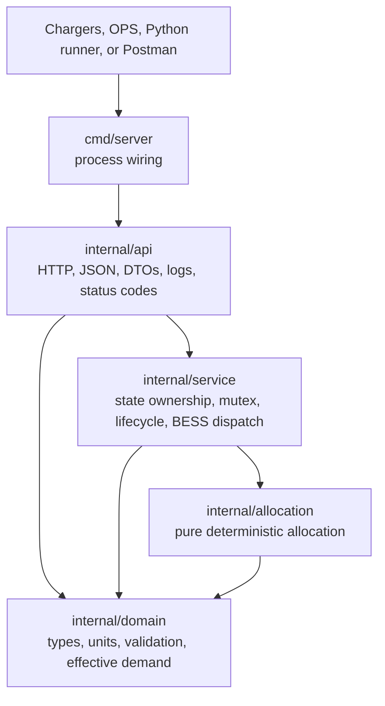
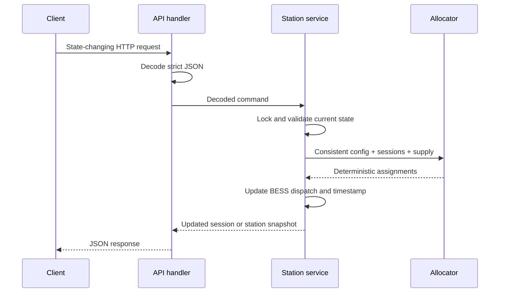

# Architecture

## Design goals

This service is the station-level load-management brain for one EV charging station. Its design goals are deliberately narrow:

- Keep every allocation safe under grid and hardware constraints.
- React synchronously to accepted station events.
- Produce deterministic and explainable results.
- Give OPS a consistent live view of the station.
- Remain easy to run, test, and discuss within a time-boxed assignment.

It is one Go process with in-memory state and no external dependencies. This is a conscious boundary, not a reduced version of a distributed platform.

## Package boundaries



### `internal/domain`

Owns station, charger, connector, session, and BESS types. It validates configuration and session input and calculates a session's effective maximum demand.

The domain package contains no HTTP or mutable service state.

### `internal/allocation`

Owns deterministic minimum-power admission and max-min fair distribution. It receives a station configuration, a session slice, and an explicit available-station-supply value, then returns assignments.

It does not lock, mutate service state, read the clock, or know whether supply came from the grid or BESS.

### `internal/service`

Owns the single mutable station instance:

- Validated station configuration
- Active and waiting sessions
- Runtime BESS SoC, power, and mode
- Last-update timestamp

It protects this state with one mutex and orchestrates configuration, session lifecycle, hardware availability, BESS ticks, allocation recomputation, and OPS snapshots.

### `internal/api`

Owns HTTP-only concerns:

- Routing with Go's standard `http.ServeMux`
- Strict JSON decoding
- Request DTOs
- Conventional status codes
- Stable JSON error responses
- Basic structured logs

Handlers are intentionally thin. They translate HTTP requests into service calls and do not implement allocation rules.

### `cmd/server`

Constructs the logger, service, router, and standard-library HTTP server. `PORT` defaults to `8080`, and a read-header timeout avoids leaving header reads unbounded.

## Why one process and the standard library

The station is one consistency boundary. A single process and service mutex are sufficient to make a mutation plus allocation recomputation atomic.

Using `net/http` avoids a framework dependency for nine small routes. The standard router supports method-aware patterns and path parameters, so an additional routing abstraction would not improve this implementation.

The project deliberately has no repository layer because there is no persistence, and no interface wraps the service because there is only one implementation. Adding either would create indirection without changing a real boundary.

## State ownership and concurrency

`service.Service` is the only owner of mutable station state. All methods that read or change that state acquire the same `sync.Mutex`.

One accepted mutation performs these operations under the lock:

1. Validate references and current-state constraints.
2. Build a candidate change without partially modifying stored state.
3. Commit the state change.
4. Run allocation against one consistent configuration and session set.
5. Update BESS dispatch and the station timestamp.
6. Build the updated result before releasing the lock for lifecycle, availability, and simulation operations.

Station configuration completes replacement and recomputation under the lock, then the handler obtains the response through the normal locked snapshot method.

Snapshots copy slices and pointer-backed values before returning them. A caller therefore cannot mutate stored configuration, charging-curve limits, or BESS state through a response object.

An exclusive mutex was chosen instead of `sync.RWMutex`. Station operations are small, allocation is in memory, and one lock makes the atomicity rule obvious. This serializes readers and writers, but avoids a more complex locking scheme for throughput the assignment does not require.

## State-changing request flow



Every accepted state-changing endpoint recomputes allocations before returning:

- Station configuration
- Session start
- Session update
- Session stop
- Charger availability update
- Connector availability update
- BESS simulation tick

There is no asynchronous internal event queue, so a successful response is the recomputation boundary.

## Configuration and session lifecycle

`PUT /api/v1/station/config` is replacement configuration for the one station. Validation occurs before stored state is replaced. Accepted configuration clears active sessions, initializes optional BESS runtime state, and computes the initial dispatch state.

Session start validates the payload, referenced connector and charger, availability, duplicate ID, connector occupancy, and minimum useful power. The session is added only after all checks pass.

Session update clones the stored session, applies only supplied power-limit fields, validates the candidate, and commits it only if valid. The original start time remains unchanged.

Session stop removes the active or waiting session and reallocates remaining supply immediately. The returned station snapshot already contains the redistributed assignments.

## Hardware availability

Chargers and connectors have explicit `available` and `unavailable` configuration states.

An availability update is applied as one atomic candidate configuration change. When hardware becomes unavailable:

1. Sessions attached to the connector or charger are removed.
2. The hardware is excluded from allocation.
3. Remaining sessions are recomputed.
4. OPS receives the new availability and power state in the response.

Restoring hardware makes it eligible for future sessions but does not recreate ended sessions. Historical failure tracking was explicitly kept out of scope; structured logs provide basic event visibility for this exercise.

## BESS dispatch and time

BESS runtime state is owned by the service rather than the allocator. This keeps the allocator concerned only with available supply.

On recomputation:

1. If SoC is above its minimum, maximum permitted BESS discharge is added to potential station supply.
2. EV power is allocated under station and hardware limits.
3. If EV load exceeds grid capacity, BESS discharge covers only that shortfall, capped by maximum discharge power.
4. Otherwise, genuinely spare grid capacity charges the BESS, capped by maximum charge power.
5. Grid import is derived as EV load minus signed BESS power.

EV demand always takes priority. The service never reduces an EV assignment merely to charge the battery.

Time does not advance in a background goroutine. `POST /api/v1/simulation/tick` applies the current BESS power for an explicit elapsed duration using:

```text
energy delta in kWh = power in kW × elapsed time in hours
```

The model assumes `100%` efficiency. SoC is clamped to the configured minimum or `100%`, and allocation is recomputed once after the tick. This is deterministic and suitable for demonstrating energy accounting, but it is not a continuous battery controller.

## OPS state

`GET /api/v1/station` returns one consistent snapshot containing:

- Grid capacity, import, and remaining grid power
- Available station power, including permitted BESS contribution
- Charger availability, limits, current power, and connectors
- Connector availability, occupancy, active session, and assigned power
- Session requested, effective, minimum, and assigned power plus status
- Optional BESS configuration, current SoC, signed power, and mode
- Last update timestamp

Chargers, connectors, and sessions are sorted by stable IDs before being returned. Sorting also makes aggregate floating-point summation deterministic.

## Error handling and observability

JSON decoding rejects unknown fields, malformed input, and multiple JSON objects in one request body.

Handlers map expected service errors to conventional responses:

- `400 Bad Request` for malformed or invalid values
- `404 Not Found` for missing configuration or resources
- `409 Conflict` for duplicate sessions, occupied connectors, or unavailable hardware
- `405 Method Not Allowed` with an `Allow` header for unsupported methods
- `500 Internal Server Error` only for unexpected failures

Every error response uses:

```json
{ "code": "machine_readable_code", "message": "human-readable explanation" }
```

The server uses `log/slog`: successful mutations are informational, expected rejections are warnings, and unexpected failures are errors. There is intentionally no hosted logging, tracing, metrics agent, or middleware stack.

## Determinism

Go map iteration order never acts as a policy decision. The implementation sorts stable identifiers before output and before order-sensitive summation. Minimum-power admission sorts by start time and then session ID. Equivalent inputs therefore produce equivalent assignments and response ordering.

Wall-clock timestamps record accepted lifecycle events, but allocation decisions do not depend on execution timing beyond the stored session start-order policy.

## Trade-offs and production evolution

| Current decision                    | Benefit                          | Production evolution                                                                |
| ----------------------------------- | -------------------------------- | ----------------------------------------------------------------------------------- |
| In-memory state                     | Simple and immediately runnable  | Durable state, event replay, and recovery after restart                             |
| One mutex                           | Clear atomicity                  | Measure first; partition state only if station-scale contention requires it         |
| One process                         | One obvious consistency boundary | Separate station agents or orchestration only when multi-station requirements exist |
| REST events                         | Easy to inspect and demonstrate  | Authenticated OCPP or hardware event integration                                    |
| Explicit BESS tick                  | Deterministic tests              | Meter-driven elapsed time and continuous controller integration                     |
| Basic `slog` output                 | No hosted dependency             | Metrics, traces, alerting, and durable audit events                                 |
| Immediate session removal on outage | Clear live state                 | Separate session history and incident records                                       |

Other realistic follow-ups include graceful HTTP shutdown, configuration versioning, idempotency keys for retried hardware events, and deployment health/readiness policies. They are not partially implemented here.

## Security boundary

Real station control is critical infrastructure. A production interface would require:

- Strong charger and operator authentication
- Authorization and least-privilege roles
- TLS or mutual TLS for hardware communication
- Network isolation and restricted ingress
- Rate limiting and request-size controls
- Audit logging and security monitoring
- Secret and certificate rotation

These controls are intentionally out of scope because the assignment evaluates load-management correctness and product decisions. The service should not be exposed to an untrusted network in its submitted form.

The system also does not implement OCPP, external persistence, Kafka, Redis, Kubernetes, distributed locking, multi-station orchestration, a frontend, tariff optimization, or detailed battery physics.
