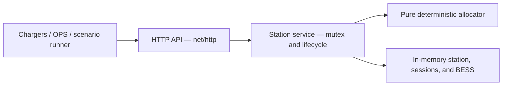
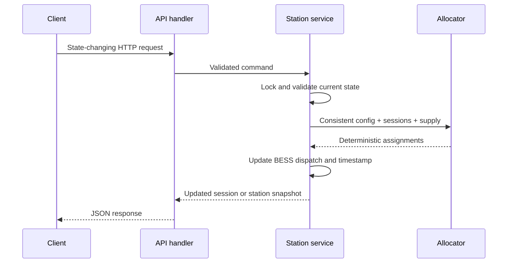

# Submission Documentation Implementation Plan

> **For agentic workers:** REQUIRED SUB-SKILL: Use superpowers:subagent-driven-development (recommended) or superpowers:executing-plans to implement this plan task-by-task. Steps use checkbox (`- [ ]`) syntax for tracking.

**Goal:** Replace internal planning artifacts with complete, accurate reviewer-facing documentation for running, testing, understanding, and defending the Station Energy Management System.

**Architecture:** Keep `README.md` self-sufficient and use three focused documents for optional depth: architecture, allocation, and testing. Preserve `CLARIFICATIONS.md`, make no production-code changes, and verify every documented command against the finished application and Docker image.

**Tech Stack:** Markdown, Mermaid, Go 1.26, Docker Compose, Python 3 standard library, Postman Collection v2.1.

## Global Constraints

- Keep `CLARIFICATIONS.md` and link it from the README.
- Do not change production behavior or add dependencies.
- Do not duplicate full explanations between the README and detailed documents.
- Keep the README sufficient to build, run, test, and understand the design in roughly five minutes.
- Document security requirements as production follow-ups, not implemented features.
- Remove `docs/superpowers/` before final submission.
- Use one commit and review checkpoint per task.

---

### Task 1: Reviewer-facing README

**Files:**
- Create: `README.md`

**Interfaces:**
- Consumes: `BRIEF.MD`, `CLARIFICATIONS.md`, `AGENTS.md`, `Dockerfile`, `docker-compose.yml`, `cmd/server/main.go`, API routes, and runnable examples.
- Produces: the primary reviewer entry point and links to `docs/ARCHITECTURE.md`, `docs/ALLOCATION.md`, `docs/TESTING.md`, and `CLARIFICATIONS.md`.

- [ ] **Step 1: Write the README structure and quick start**

Create these sections in order:

```markdown
# Station Energy Management System

## What it does
## Implemented scope
## Quick start with Docker
## Run locally
## HTTP API
## Architecture
## Allocation policy
## Minimum useful power
## Hardware availability
## BESS behavior
## State, concurrency, and latency
## Tests and runnable scenarios
## Assumptions and trade-offs
## Security and out of scope
## Production follow-ups
## Detailed documentation
```

Use these exact primary commands:

```bash
docker compose up --build
python3 examples/run_scenarios.py

go run ./cmd/server
go test ./...
go test -race ./...
go vet ./...
go build ./...
go test ./internal/api -run '^$' -bench BenchmarkSessionLifecycle -benchtime=100x
```

- [ ] **Step 2: Add the compact API reference**

Document the complete route surface:

```text
GET    /health
PUT    /api/v1/station/config
GET    /api/v1/station
POST   /api/v1/sessions
PATCH  /api/v1/sessions/{sessionId}
DELETE /api/v1/sessions/{sessionId}
PATCH  /api/v1/chargers/{chargerId}
PATCH  /api/v1/connectors/{connectorId}
POST   /api/v1/simulation/tick
```

Include the JSON error contract:

```json
{"code":"connector_occupied","message":"connector is occupied"}
```

State that configuration and session requests use kW, BESS capacity uses kWh, and the simulation endpoint accepts `{"elapsedSeconds":900}`.

- [ ] **Step 3: Add architecture and behavior summaries**

Include a high-level Mermaid diagram with these exact boundaries:



Summarize effective demand as:

```text
min(requested power, vehicle maximum, optional curve limit, connector maximum)
```

Explain charger caps, grid/BESS supply, deterministic max-min sharing, synchronous recomputation, the `5 kW` default useful minimum, waiting status, hardware-unavailability termination, and EV-first BESS dispatch.

- [ ] **Step 4: Record assumptions, trade-offs, security, and exclusions**

Include all of the following decisions:

- One station, in-memory state, restart resets state.
- One mutex keeps mutation and recomputation atomic.
- Equal fair sharing; no booking, customer, vehicle-SoC, or session-age priority.
- Start time then session ID is used only for deterministic minimum-power admission.
- Positive BESS power is discharge; negative power is charging.
- BESS uses 100% efficiency and an explicit deterministic tick.
- SoC may reach the configured `10%` floor but cannot discharge further.
- Large ticks clamp at the boundary and recompute afterward.
- Unavailable hardware removes affected active sessions; history/failure tracking is omitted.
- Authentication, authorization, TLS/mTLS, rate limiting, audit logging, and network isolation are required for production but out of scope.
- No external database, Kafka, Redis, Kubernetes, OCPP, frontend, distributed services, multi-station orchestration, tariff model, or battery chemistry model.

- [ ] **Step 5: Verify README accuracy and commit**

Run:

```bash
git diff --check
rg -n "docker compose up --build|python3 examples/run_scenarios.py|BenchmarkSessionLifecycle|CLARIFICATIONS.md" README.md
```

Expected: no whitespace errors and all four reviewer entry points are present.

Commit:

```bash
git add README.md
git commit -m "docs: add reviewer README"
```

---

### Task 2: Detailed architecture documentation

**Files:**
- Create: `docs/ARCHITECTURE.md`

**Interfaces:**
- Consumes: the package boundaries and runtime behavior implemented in `cmd/server` and `internal`.
- Produces: the detailed architecture, mutation flow, BESS flow, security assumptions, and production evolution linked by the README.

- [ ] **Step 1: Document package ownership and request flow**

Create these sections:

```markdown
# Architecture
## Design goals
## Package boundaries
## State ownership and concurrency
## State-changing request flow
## Session lifecycle
## Hardware availability
## BESS dispatch and time
## Error handling and observability
## Determinism
## Trade-offs and production evolution
## Security boundary
```

Describe `domain`, `allocation`, `service`, `api`, and `cmd/server` without inventing repositories, interfaces, or external components.

- [ ] **Step 2: Add focused architecture diagrams**

Add one package diagram and this mutation sequence:



State clearly that accepted mutations recompute before returning and readers cannot observe partially applied state.

- [ ] **Step 3: Document the deliberately small design**

Explain why the implementation uses:

- Standard `net/http` instead of a framework.
- One process and one mutex instead of an event bus or distributed locking.
- In-memory state instead of persistence.
- Explicit BESS ticks instead of a goroutine.
- Structured `slog` output instead of hosted observability.

Identify persistence/event replay, OCPP integration, metrics/tracing, graceful shutdown, durable hardware events, and multi-station orchestration as production follow-ups.

- [ ] **Step 4: Verify and commit**

Run:

```bash
git diff --check
rg -n "net/http|mutex|synchronous|BESS|authentication|rate limiting" docs/ARCHITECTURE.md
```

Expected: all architectural decisions and the security boundary are present.

Commit:

```bash
git add docs/ARCHITECTURE.md
git commit -m "docs: explain system architecture"
```

---

### Task 3: Detailed allocation documentation

**Files:**
- Create: `docs/ALLOCATION.md`

**Interfaces:**
- Consumes: `internal/domain/validation.go`, `internal/allocation/allocator.go`, and `internal/service/bess.go`.
- Produces: a reviewer-readable explanation of the allocator, minimum admission, invariants, examples, and complexity.

- [ ] **Step 1: Explain limits and invariants**

Create these sections:

```markdown
# Allocation and Power Policy
## Units and numeric tolerance
## Effective demand
## Available station supply
## Deterministic minimum-power admission
## Max-min fair distribution
## Charger-level constraints and redistribution
## BESS interaction
## Hard invariants
## Worked examples
## Complexity and trade-offs
```

List the implemented invariants: grid import bounds, connector/session/charger caps, one active session per connector, zero power on unavailable hardware, synchronous recomputation, stable output, minimum/waiting behavior, and BESS power/SoC bounds.

- [ ] **Step 2: Explain the algorithm directly**

Document the implemented stages:

```text
1. Build eligible session state and effective demand.
2. Sort stable identifiers.
3. Reserve useful minimums by start time then session ID.
4. Mark sessions that cannot receive their minimum as waiting at 0 kW.
5. Raise the lowest active allocations together.
6. Stop a session or charger group at its demand or physical cap.
7. Redistribute remaining power until no supply or eligible demand remains.
```

Explain that BESS discharge increases the supply passed to the allocator only above minimum SoC; actual discharge is limited to EV demand above grid capacity.

- [ ] **Step 3: Add worked examples and complexity**

Include three compact examples:

1. `300 kW` grid with two equal `250 kW` demands gives `150/150 kW`.
2. `300 kW` grid with `50 kW` and `300 kW` demands gives `50/250 kW`.
3. `400 kW` grid plus `200 kW` BESS with two `300 kW` demands gives `300/300 kW`, `400 kW` grid import, and `200 kW` BESS discharge.

Describe complexity as sorting plus iterative scans over the small active-session set; favor clarity and determinism over optimization for very large fleets.

- [ ] **Step 4: Verify and commit**

Run:

```bash
git diff --check
rg -n "150/150|50/250|300/300|waiting_for_power|start time|session ID" docs/ALLOCATION.md
```

Expected: all examples and deterministic admission details are present.

Commit:

```bash
git add docs/ALLOCATION.md
git commit -m "docs: explain allocation policy"
```

---

### Task 4: Testing guide and scenario migration

**Files:**
- Create: `docs/TESTING.md`
- Delete: `TEST_SCENARIOS.md`
- Modify: `README.md`

**Interfaces:**
- Consumes: the existing scenario descriptions, Go test names, Python runner, Postman collection, Docker setup, and lifecycle benchmark.
- Produces: one canonical detailed testing guide with a valid README link.

- [ ] **Step 1: Move and refine the scenario guide**

Move the content of `TEST_SCENARIOS.md` to `docs/TESTING.md`. Keep all 16 scenario explanations and update the introduction to distinguish:

- Pure allocation tests for physical invariants.
- Service tests for lifecycle and atomic recomputation.
- API tests for transport and error mapping.
- Python/Postman flows for reviewer demonstrations.

Do not retain a duplicate root scenario document.

- [ ] **Step 2: Add copyable execution instructions**

Include:

```bash
go test ./...
go test -race ./...
go vet ./...
go build ./...
go test ./internal/api -run '^$' -bench BenchmarkSessionLifecycle -benchtime=100x

docker compose up --build -d
python3 examples/run_scenarios.py
```

Explain that the Postman collection is `examples/electra-station.postman_collection.json`, uses `http://localhost:8080`, and must run in collection order because requests build on prior station state.

- [ ] **Step 3: Update links and verify scenario references**

Ensure `README.md` links to `docs/TESTING.md` and no tracked documentation references the deleted root file.

Run:

```bash
git diff --check
rg -n "TEST_SCENARIOS.md" README.md docs examples internal || true
rg -n "BenchmarkSessionLifecycle|run_scenarios.py|postman_collection" docs/TESTING.md
```

Expected: no stale root-file references and all three runnable entry points are documented.

- [ ] **Step 4: Commit**

```bash
git add README.md docs/TESTING.md TEST_SCENARIOS.md
git commit -m "docs: organize testing guidance"
```

---

### Task 5: Internal-doc cleanup and final acceptance

**Files:**
- Delete: `docs/superpowers/`
- Preserve: `CLARIFICATIONS.md`
- Verify: `README.md`, `docs/ARCHITECTURE.md`, `docs/ALLOCATION.md`, `docs/TESTING.md`

**Interfaces:**
- Consumes: all reviewer-facing documentation produced by Tasks 1–4.
- Produces: the final submission documentation set with no internal planning artifacts.

- [ ] **Step 1: Remove internal planning material**

Delete every tracked file under `docs/superpowers/`, including this plan and the temporary documentation design. Do not delete or rename `CLARIFICATIONS.md`.

- [ ] **Step 2: Validate documentation structure and JSON artifacts**

Run:

```bash
test -f README.md
test -f CLARIFICATIONS.md
test -f docs/ARCHITECTURE.md
test -f docs/ALLOCATION.md
test -f docs/TESTING.md
test ! -e docs/superpowers
python3 -c 'import json; json.load(open("examples/scenarios.json")); json.load(open("examples/electra-station.postman_collection.json"))'
```

Expected: all reviewer documents exist, internal plans are absent, and both JSON artifacts parse.

- [ ] **Step 3: Run application acceptance commands**

Run:

```bash
gofmt -l .
go test -count=1 ./...
go test -race -count=1 ./...
go vet ./...
go build ./...
go test ./internal/api -run '^$' -bench BenchmarkSessionLifecycle -benchtime=100x
docker compose up --build -d
python3 examples/run_scenarios.py
```

Expected: no formatting output; all Go commands and Docker scenarios pass; the full HTTP lifecycle remains far below `1,000,000,000 ns/op`.

- [ ] **Step 4: Check links, repository noise, and requirements**

Verify the documented relative targets resolve, then run:

```bash
for path in CLARIFICATIONS.md docs/ARCHITECTURE.md docs/ALLOCATION.md docs/TESTING.md examples/run_scenarios.py examples/scenarios.json examples/electra-station.postman_collection.json; do test -e "$path" || exit 1; done
git diff --check
git status --short
git ls-files | rg "docs/superpowers|\.DS_Store|__pycache__|\.pyc$" || true
```

Review the final documents against `BRIEF.MD`, `CLARIFICATIONS.md`, and `AGENTS.md`. Confirm the README covers architecture decisions, trade-offs, assumptions, security, test/run instructions, out-of-scope items, and production follow-ups.

- [ ] **Step 5: Commit final cleanup**

```bash
git add -A README.md CLARIFICATIONS.md docs
git commit -m "docs: finalize submission documentation"
```
